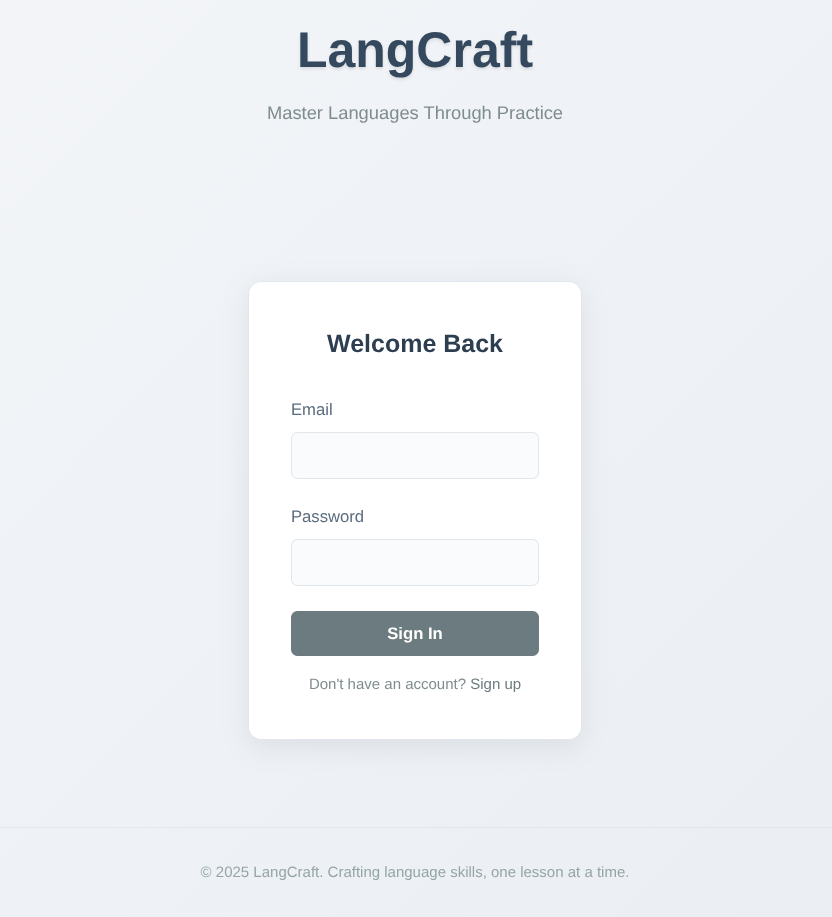
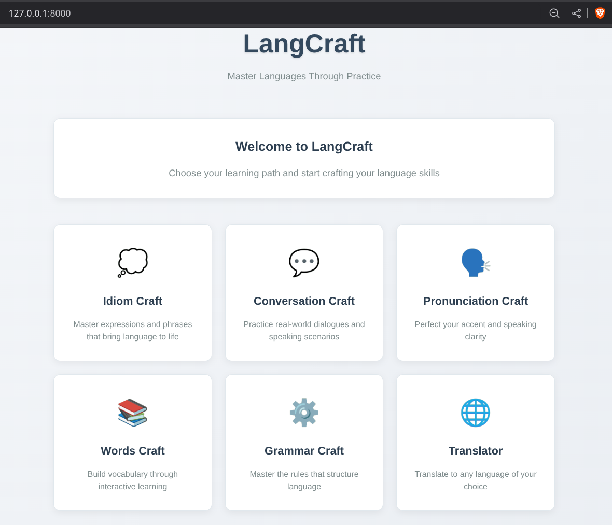
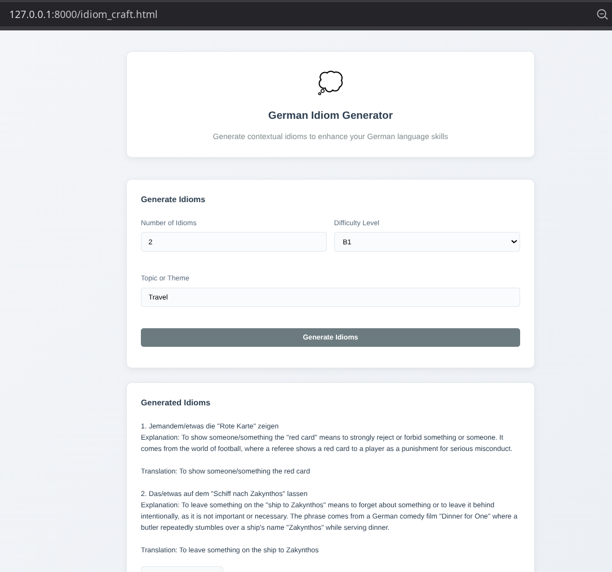

# LangCraft: AI-Powered Language Learning Platform

LangCraft is an interactive web application for learning German through AI-powered exercises, games, and feedback. It features multiple learning modules including idioms, grammar, conversation, pronunciation, and translation, all leveraging modern LLMs (Large Language Models) to create engaging language activities.

---

## Features

- **Multiple Learning Modules:**
  - **Idiom Learning:** Generate German idioms by topic and level with matching exercises
  - **Grammar Practice:** Interactive grammar exercises and corrections
  - **Conversation Training:** AI-powered conversation practice
  - **Pronunciation Feedback:** Speech recognition and pronunciation guidance
  - **Translation Tools:** Bidirectional translation with context
- **AI-Powered Feedback:** Get intelligent feedback on your language usage
- **Session Memory:** Track user progress and session history
- **Modern UI:** Responsive, user-friendly interface with multiple themes

---

## Project Structure

```
langcraft/
├── craft_modules/          # Learning modules (idiom, grammar, conversation, etc.)
├── api/                    # FastAPI endpoints and schemas
├── templates/              # HTML templates
├── static/                 # CSS files
├── notebooks/              # Jupyter notebooks for prototyping
├── docs/                   # Documentation
├── main.py                 # Main FastAPI application
└── .env                    # Environment variables
```

---

## Getting Started

### Prerequisites

- Python 3.10 or higher
- [UV](https://docs.astral.sh/uv/) (recommended) or pip for dependency management

### 1. Clone the repository

```bash
git clone https://github.com/yourusername/langcraft.git
cd langcraft
```

### 2. Install dependencies

**Option A: Using UV (recommended)**
```bash
uv sync
```

**Option B: Using pip**
```bash
python -m venv .venv
source .venv/bin/activate  # On Windows: .venv\Scripts\activate
pip install -r requirements.txt
```

### 3. Set up environment variables

Create a `.env` file in the project root with your API keys:

```env
OPENAI_API_KEY=sk-...
MISTRAL_API_KEY=...
HUGGINGFACE_API_KEY=...
```

### 4. Run the application

**With UV:**
```bash
uv run uvicorn main:app --reload
```

**With pip:**
```bash
uvicorn main:app --reload
```

Visit [http://localhost:8000](http://localhost:8000) in your browser.

---

## Usage

- **Idiom Learning:** Choose topic and level, then generate idioms with matching exercises
- **Grammar Practice:** Work through interactive grammar exercises with AI feedback
- **Conversation Training:** Engage in AI-powered conversations to improve fluency
- **Pronunciation Practice:** Get feedback on your German pronunciation
- **Translation Tools:** Translate text with context-aware AI assistance
- **Progress Tracking:** Your session history is saved for personalized learning

---

## Development

### Running Tests

```bash
# Run API tests
uv run python -m pytest api/endpoints_test.py

# Or with pip
python -m pytest api/endpoints_test.py
```

### Project Dependencies

Key dependencies include:
- **FastAPI** - Web framework
- **LangChain** - LLM integration and chains
- **Uvicorn** - ASGI server
- **Transformers** - Hugging Face models
- **LangGraph** - Workflow orchestration

See `pyproject.toml` for the complete list of dependencies.

---

## API Documentation

Once the application is running, visit:
- API Documentation: [http://localhost:8000/docs](http://localhost:8000/docs)
- Alternative docs: [http://localhost:8000/redoc](http://localhost:8000/redoc)

---

## Visual




## License

This project is licensed under the [MIT License](LICENSE)